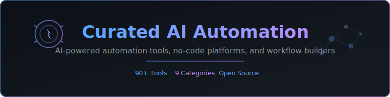

<!-- BANNER -->

# Curated AI Automation

**A curated list of AI-powered automation tools, no-code platforms, and workflow builders.**

[Browse Online](https://awesome-ai-tools.github.io/curated-ai-automation/) | [Submit a Tool](#contributing) | [Report Broken Link](https://github.com/awesome-ai-tools/curated-ai-automation/issues/new?template=broken-link.yml)

---

## Featured

### Ssemble AI Clipping

> **Automatically turn long videos into viral short clips using AI.** Ssemble provides an MCP server that integrates directly with AI assistants like Claude to create, manage, and customize short-form video content from YouTube videos or uploaded files.

- **MCP Server**: [npmjs.com/package/@ssemble/mcp-server](https://www.npmjs.com/package/@ssemble/mcp-server) -- Install via `npx @ssemble/mcp-server` for direct AI assistant integration
- **Website**: [ssemble.com](https://www.ssemble.com) -- Full video editing platform with AI-powered clipping, captions, templates, and more
- **Key Features**: AI scene detection, viral score ranking, auto-captions, hook titles, background music, gameplay overlays, meme hooks

---

## Contents

- [Workflow Platforms](#workflow-platforms)
- [AI-Native Automation](#ai-native-automation)
- [Chatbot Builders](#chatbot-builders)
- [RPA (Robotic Process Automation)](#rpa-robotic-process-automation)
- [Email & Marketing Automation](#email--marketing-automation)
- [Data Automation](#data-automation)
- [Document Processing](#document-processing)
- [Browser Automation](#browser-automation)
- [Voice & Phone Automation](#voice--phone-automation)
- [Recently Added](#recently-added)
- [Related Lists](#related-lists)
- [Contributing](#contributing)

---

## Workflow Platforms

General-purpose automation platforms that connect apps and services through triggers and actions.

| Tool | Description | Type | Link |
|------|-------------|------|------|
| [Zapier](https://zapier.com) | Connect 6,000+ apps with no-code workflows, AI-powered suggestions, and conditional logic. | Commercial | [zapier.com](https://zapier.com) |
| [Make](https://www.make.com) | Visual automation platform (formerly Integromat) with advanced branching, iterators, and data transformations. | Commercial | [make.com](https://www.make.com) |
| [n8n](https://github.com/n8n-io/n8n) | Fair-code workflow automation with 400+ integrations. Self-hostable with a visual editor. | Open Source | [github.com/n8n-io/n8n](https://github.com/n8n-io/n8n) |
| [Activepieces](https://github.com/activepieces/activepieces) | Open-source no-code business automation with a pieces-based architecture for extensibility. | Open Source | [github.com/activepieces/activepieces](https://github.com/activepieces/activepieces) |
| [Automatisch](https://github.com/automatisch/automatisch) | Open-source Zapier alternative. Self-hosted business automation with a clean UI. | Open Source | [github.com/automatisch/automatisch](https://github.com/automatisch/automatisch) |
| [Windmill](https://github.com/windmill-labs/windmill) | Developer-first workflow engine for scripts, flows, and apps. Supports Python, TypeScript, Go, SQL. | Open Source | [github.com/windmill-labs/windmill](https://github.com/windmill-labs/windmill) |
| [Pipedream](https://pipedream.com) | Developer-focused workflow platform with built-in code steps, 1,000+ integrations, and free tier. | Commercial | [pipedream.com](https://pipedream.com) |
| [Tray.io](https://tray.io) | Enterprise integration and automation platform with AI-assisted workflow building. | Commercial | [tray.io](https://tray.io) |
| [Workato](https://www.workato.com) | Enterprise automation with AI co-pilot, recipe-based workflows, and deep API orchestration. | Commercial | [workato.com](https://www.workato.com) |
| [Temporal](https://github.com/temporalio/temporal) | Durable execution platform for running reliable, long-running workflows at scale. | Open Source | [github.com/temporalio/temporal](https://github.com/temporalio/temporal) |
| [Prefect](https://github.com/PrefectHQ/prefect) | Modern workflow orchestration framework for data pipelines with Python-native API. | Open Source | [github.com/PrefectHQ/prefect](https://github.com/PrefectHQ/prefect) |
| [Huginn](https://github.com/huginn/huginn) | System for building agents that perform automated tasks online. Self-hosted IFTTT alternative. | Open Source | [github.com/huginn/huginn](https://github.com/huginn/huginn) |

## AI-Native Automation

Platforms built with AI at the core, using LLMs and agents to power automation.

| Tool | Description | Type | Link |
|------|-------------|------|------|
| [Relevance AI](https://relevanceai.com) | Build and deploy AI agents and tool chains for sales, support, and operations. | Commercial | [relevanceai.com](https://relevanceai.com) |
| [Lindy AI](https://www.lindy.ai) | AI employee platform that creates autonomous agents for scheduling, email, research, and more. | Commercial | [lindy.ai](https://www.lindy.ai) |
| [Bardeen](https://www.bardeen.ai) | AI-powered browser automation that builds workflows from natural language commands. | Commercial | [bardeen.ai](https://www.bardeen.ai) |
| [Axiom](https://axiom.ai) | No-code browser automation with AI actions for web scraping and interaction. | Commercial | [axiom.ai](https://axiom.ai) |
| [Browse AI](https://www.browse.ai) | Train AI robots to extract and monitor data from any website, no coding required. | Commercial | [browse.ai](https://www.browse.ai) |
| [Cassidy AI](https://cassidyai.com) | AI workspace that connects to your tools and builds custom AI assistants for teams. | Commercial | [cassidyai.com](https://cassidyai.com) |
| [Respell](https://www.respell.ai) | Build AI workflows (spells) visually with drag-and-drop LLM steps and integrations. | Commercial | [respell.ai](https://www.respell.ai) |
| [LangChain](https://github.com/langchain-ai/langchain) | Framework for developing applications powered by LLMs with chains, agents, and retrieval. | Open Source | [github.com/langchain-ai/langchain](https://github.com/langchain-ai/langchain) |
| [CrewAI](https://github.com/crewAIInc/crewAI) | Framework for orchestrating role-playing autonomous AI agents that work together. | Open Source | [github.com/crewAIInc/crewAI](https://github.com/crewAIInc/crewAI) |
| [AutoGen](https://github.com/microsoft/autogen) | Microsoft's framework for building multi-agent AI applications with conversation patterns. | Open Source | [github.com/microsoft/autogen](https://github.com/microsoft/autogen) |
| [Dust](https://github.com/dust-tt/dust) | Platform for building and deploying large language model apps with composable blocks. | Open Source | [github.com/dust-tt/dust](https://github.com/dust-tt/dust) |
| [Superagent](https://github.com/superagent-ai/superagent) | Open-source AI assistant framework with built-in RAG, tools, and memory. | Open Source | [github.com/superagent-ai/superagent](https://github.com/superagent-ai/superagent) |

## Chatbot Builders

Platforms for building conversational AI chatbots and virtual assistants.

| Tool | Description | Type | Link |
|------|-------------|------|------|
| [Botpress](https://github.com/botpress/botpress) | Open-source platform for building AI-powered chatbots with visual flow editor and LLM integration. | Open Source | [github.com/botpress/botpress](https://github.com/botpress/botpress) |
| [Voiceflow](https://www.voiceflow.com) | Collaborative platform for designing, prototyping, and launching AI agents and chatbots. | Commercial | [voiceflow.com](https://www.voiceflow.com) |
| [Typebot](https://github.com/baptisteArno/typebot.io) | Open-source conversational form builder with rich UI, logic branching, and integrations. | Open Source | [github.com/baptisteArno/typebot.io](https://github.com/baptisteArno/typebot.io) |
| [Rasa](https://github.com/RasaHQ/rasa) | Open-source framework for building contextual AI assistants with NLU, dialogue, and integrations. | Open Source | [github.com/RasaHQ/rasa](https://github.com/RasaHQ/rasa) |
| [Chainlit](https://github.com/Chainlit/chainlit) | Build production-ready conversational AI applications in minutes with Python. | Open Source | [github.com/Chainlit/chainlit](https://github.com/Chainlit/chainlit) |
| [Flowise](https://github.com/FlowiseAI/Flowise) | Drag-and-drop UI to build LLM flows and chatbots using LangChain components. | Open Source | [github.com/FlowiseAI/Flowise](https://github.com/FlowiseAI/Flowise) |
| [Chatbase](https://www.chatbase.co) | Build custom AI chatbots trained on your data. Embed on websites or connect via API. | Commercial | [chatbase.co](https://www.chatbase.co) |
| [Intercom Fin](https://www.intercom.com/fin) | AI customer service agent built on GPT-4 that resolves support questions instantly. | Commercial | [intercom.com/fin](https://www.intercom.com/fin) |
| [Stack AI](https://www.stack-ai.com) | No-code platform for building AI applications, chatbots, and document processors. | Commercial | [stack-ai.com](https://www.stack-ai.com) |
| [Dify](https://github.com/langgenius/dify) | Open-source LLM app development platform with visual orchestration for chatbots and agents. | Open Source | [github.com/langgenius/dify](https://github.com/langgenius/dify) |

## RPA (Robotic Process Automation)

Tools for automating repetitive tasks by simulating human interactions with software.

| Tool | Description | Type | Link |
|------|-------------|------|------|
| [UiPath](https://www.uipath.com) | Enterprise RPA platform with AI-powered document understanding, process mining, and orchestration. | Commercial | [uipath.com](https://www.uipath.com) |
| [Automation Anywhere](https://www.automationanywhere.com) | Cloud-native intelligent automation with AI-powered bots for enterprise processes. | Commercial | [automationanywhere.com](https://www.automationanywhere.com) |
| [Power Automate](https://powerautomate.microsoft.com) | Microsoft's RPA and workflow automation with AI Builder, desktop flows, and cloud connectors. | Commercial | [powerautomate.microsoft.com](https://powerautomate.microsoft.com) |
| [TagUI](https://github.com/aisingapore/TagUI) | Open-source RPA tool by AI Singapore. Automate web, desktop, and CLI with natural language. | Open Source | [github.com/aisingapore/TagUI](https://github.com/aisingapore/TagUI) |
| [Robot Framework](https://github.com/robotframework/robotframework) | Generic open-source automation framework for acceptance testing and RPA. | Open Source | [github.com/robotframework/robotframework](https://github.com/robotframework/robotframework) |
| [RoboCorp](https://robocorp.com) | Python-based open-source RPA platform with cloud orchestration and pre-built automation packages. | Commercial | [robocorp.com](https://robocorp.com) |
| [OpenRPA](https://github.com/open-rpa/openrpa) | Free, open-source enterprise-grade RPA tool with recording, selectors, and workflow designer. | Open Source | [github.com/open-rpa/openrpa](https://github.com/open-rpa/openrpa) |
| [Automagica](https://github.com/automagica/automagica) | Open-source smart process automation with AI-powered activities and Python scripting. | Open Source | [github.com/automagica/automagica](https://github.com/automagica/automagica) |
| [Blue Prism](https://www.blueprism.com) | Enterprise intelligent automation with digital workforce management and process discovery. | Commercial | [blueprism.com](https://www.blueprism.com) |
| [SAP Build Process Automation](https://www.sap.com/products/technology-platform/process-automation.html) | SAP's low-code process automation with AI, RPA bots, and workflow management. | Commercial | [sap.com](https://www.sap.com/products/technology-platform/process-automation.html) |

## Email & Marketing Automation

AI-powered tools for automating email outreach, lead generation, and marketing workflows.

| Tool | Description | Type | Link |
|------|-------------|------|------|
| [Instantly.ai](https://instantly.ai) | AI-powered cold email platform with unlimited accounts, warmup, and lead enrichment. | Commercial | [instantly.ai](https://instantly.ai) |
| [Smartlead](https://www.smartlead.ai) | Cold email outreach tool with AI warmup, multi-channel sequences, and unified inbox. | Commercial | [smartlead.ai](https://www.smartlead.ai) |
| [Clay](https://www.clay.com) | AI-powered data enrichment and personalized outreach platform with 75+ data providers. | Commercial | [clay.com](https://www.clay.com) |
| [Apollo.io](https://www.apollo.io) | Sales intelligence and engagement platform with AI-assisted email sequences and prospecting. | Commercial | [apollo.io](https://www.apollo.io) |
| [Mailchimp](https://mailchimp.com) | All-in-one marketing platform with AI-powered content optimization and send-time prediction. | Commercial | [mailchimp.com](https://mailchimp.com) |
| [ActiveCampaign](https://www.activecampaign.com) | Marketing automation with AI predictive sending, content generation, and CRM integration. | Commercial | [activecampaign.com](https://www.activecampaign.com) |
| [Brevo](https://www.brevo.com) | Marketing platform (formerly Sendinblue) with AI subject line optimization and smart sending. | Commercial | [brevo.com](https://www.brevo.com) |
| [Lemlist](https://www.lemlist.com) | Personalized cold outreach with AI-generated icebreakers, multi-channel sequences, and warmup. | Commercial | [lemlist.com](https://www.lemlist.com) |
| [Customer.io](https://customer.io) | Automated messaging platform for targeted emails, push notifications, and SMS based on behavior. | Commercial | [customer.io](https://customer.io) |
| [Resend](https://github.com/resend/resend-node) | Developer-friendly email API built for modern apps with React Email integration. | Open Source | [github.com/resend/resend-node](https://github.com/resend/resend-node) |

## Data Automation

Tools for automating data pipelines, ETL processes, and data quality operations.

| Tool | Description | Type | Link |
|------|-------------|------|------|
| [Airbyte](https://github.com/airbytehq/airbyte) | Open-source ELT platform with 300+ pre-built connectors for data integration. | Open Source | [github.com/airbytehq/airbyte](https://github.com/airbytehq/airbyte) |
| [Fivetran](https://www.fivetran.com) | Automated data movement platform with 500+ connectors and schema drift handling. | Commercial | [fivetran.com](https://www.fivetran.com) |
| [dbt](https://github.com/dbt-labs/dbt-core) | Transform data in your warehouse using SQL and software engineering best practices. | Open Source | [github.com/dbt-labs/dbt-core](https://github.com/dbt-labs/dbt-core) |
| [Dagster](https://github.com/dagster-io/dagster) | Cloud-native data orchestration with asset-based pipelines and integrated lineage. | Open Source | [github.com/dagster-io/dagster](https://github.com/dagster-io/dagster) |
| [Apache Airflow](https://github.com/apache/airflow) | Platform to programmatically author, schedule, and monitor data workflows. | Open Source | [github.com/apache/airflow](https://github.com/apache/airflow) |
| [Meltano](https://github.com/meltano/meltano) | Open-source DataOps platform for the full data lifecycle, built on Singer taps. | Open Source | [github.com/meltano/meltano](https://github.com/meltano/meltano) |
| [Hightouch](https://hightouch.com) | Reverse ETL platform that syncs data from your warehouse to 150+ SaaS tools. | Commercial | [hightouch.com](https://hightouch.com) |
| [Census](https://www.getcensus.com) | Operational analytics platform for syncing warehouse data to business tools. | Commercial | [getcensus.com](https://www.getcensus.com) |
| [Great Expectations](https://github.com/great-expectations/great_expectations) | Python library for data validation, documentation, and profiling. | Open Source | [github.com/great-expectations/great_expectations](https://github.com/great-expectations/great_expectations) |
| [Stitch](https://www.stitchdata.com) | Simple, extensible ETL service built for developers with 130+ data sources. | Commercial | [stitchdata.com](https://www.stitchdata.com) |

## Document Processing

AI-powered tools for extracting, classifying, and processing information from documents.

| Tool | Description | Type | Link |
|------|-------------|------|------|
| [Nanonets](https://nanonets.com) | AI-powered intelligent document processing with OCR, extraction, and workflow automation. | Commercial | [nanonets.com](https://nanonets.com) |
| [Rossum](https://rossum.ai) | AI document gateway for automating transactional document workflows and data capture. | Commercial | [rossum.ai](https://rossum.ai) |
| [Parseur](https://parseur.com) | AI-powered email and document parser that extracts data from PDFs, emails, and attachments. | Commercial | [parseur.com](https://parseur.com) |
| [Sensible](https://www.sensible.so) | Developer-first document extraction API using natural language and LLM-powered queries. | Commercial | [sensible.so](https://www.sensible.so) |
| [Docsumo](https://www.docsumo.com) | Intelligent document processing for invoices, receipts, bank statements, and more. | Commercial | [docsumo.com](https://www.docsumo.com) |
| [Unstructured](https://github.com/Unstructured-IO/unstructured) | Open-source library for preprocessing and ingesting unstructured data (PDFs, HTML, images). | Open Source | [github.com/Unstructured-IO/unstructured](https://github.com/Unstructured-IO/unstructured) |
| [Marker](https://github.com/VikParuchuri/marker) | Fast, high-accuracy PDF to markdown converter using deep learning models. | Open Source | [github.com/VikParuchuri/marker](https://github.com/VikParuchuri/marker) |
| [Papermerge](https://github.com/ciur/papermerge) | Open-source document management system with OCR, full-text search, and tagging. | Open Source | [github.com/ciur/papermerge](https://github.com/ciur/papermerge) |
| [ABBYY Vantage](https://www.abbyy.com/vantage/) | Intelligent document processing platform with pre-trained AI skills for various document types. | Commercial | [abbyy.com/vantage](https://www.abbyy.com/vantage/) |
| [Docparser](https://docparser.com) | Extract data from PDF documents and scanned images using zonal OCR and parsing rules. | Commercial | [docparser.com](https://docparser.com) |

## Browser Automation

Tools for automating web browser interactions, testing, and scraping.

| Tool | Description | Type | Link |
|------|-------------|------|------|
| [Browser Use](https://github.com/browser-use/browser-use) | AI-powered browser automation that lets LLMs interact with websites through natural language. | Open Source | [github.com/browser-use/browser-use](https://github.com/browser-use/browser-use) |
| [Skyvern](https://github.com/Skyvern-AI/skyvern) | AI agent that automates browser workflows using LLMs and computer vision, no brittle scripts needed. | Open Source | [github.com/Skyvern-AI/skyvern](https://github.com/Skyvern-AI/skyvern) |
| [Playwright](https://github.com/microsoft/playwright) | Microsoft's cross-browser automation library for end-to-end testing in all modern browsers. | Open Source | [github.com/microsoft/playwright](https://github.com/microsoft/playwright) |
| [Puppeteer](https://github.com/puppeteer/puppeteer) | Google's Node.js library for controlling Chrome/Chromium via DevTools Protocol. | Open Source | [github.com/puppeteer/puppeteer](https://github.com/puppeteer/puppeteer) |
| [Selenium](https://github.com/SeleniumHQ/selenium) | The original browser automation framework, supporting all major browsers and languages. | Open Source | [github.com/SeleniumHQ/selenium](https://github.com/SeleniumHQ/selenium) |
| [Crawlee](https://github.com/apify/crawlee) | Scalable web crawling and scraping library for Node.js with anti-blocking features. | Open Source | [github.com/apify/crawlee](https://github.com/apify/crawlee) |
| [Apify](https://apify.com) | Web scraping and automation platform with serverless cloud infrastructure and 1,500+ ready-made actors. | Commercial | [apify.com](https://apify.com) |
| [PhantomBuster](https://phantombuster.com) | Code-free automation for lead generation, scraping, and outreach across social platforms. | Commercial | [phantombuster.com](https://phantombuster.com) |
| [Cypress](https://github.com/cypress-io/cypress) | JavaScript end-to-end testing framework with time travel debugging and automatic waiting. | Open Source | [github.com/cypress-io/cypress](https://github.com/cypress-io/cypress) |
| [Mechanize](https://github.com/sparklemotion/mechanize) | Ruby library for automating website interaction, form submission, and web scraping. | Open Source | [github.com/sparklemotion/mechanize](https://github.com/sparklemotion/mechanize) |

## Voice & Phone Automation

AI-powered tools for automating phone calls, voice interactions, and telephony workflows.

| Tool | Description | Type | Link |
|------|-------------|------|------|
| [Bland AI](https://www.bland.ai) | AI phone calling platform that makes and receives enterprise-grade phone calls at scale. | Commercial | [bland.ai](https://www.bland.ai) |
| [Vapi](https://vapi.ai) | Developer platform for building voice AI agents with real-time conversation and tool use. | Commercial | [vapi.ai](https://vapi.ai) |
| [Retell AI](https://www.retellai.com) | Build human-like AI voice agents for phone calls with low latency and natural conversation. | Commercial | [retellai.com](https://www.retellai.com) |
| [Air AI](https://www.air.ai) | Autonomous AI agent that handles full-length 10-40 minute sales and customer service calls. | Commercial | [air.ai](https://www.air.ai) |
| [Synthflow](https://synthflow.ai) | No-code AI voice agent builder for appointment booking, qualification, and customer support. | Commercial | [synthflow.ai](https://synthflow.ai) |
| [Twilio](https://www.twilio.com) | Cloud communications platform with APIs for voice, SMS, video, and WhatsApp automation. | Commercial | [twilio.com](https://www.twilio.com) |
| [Vocode](https://github.com/vocodedev/vocode-core) | Open-source library for building voice-based LLM agents with real-time conversation support. | Open Source | [github.com/vocodedev/vocode-core](https://github.com/vocodedev/vocode-core) |
| [Pipecat](https://github.com/pipecat-ai/pipecat) | Open-source framework for building voice and multimodal conversational AI agents. | Open Source | [github.com/pipecat-ai/pipecat](https://github.com/pipecat-ai/pipecat) |
| [Bolna](https://github.com/bolna-ai/bolna) | Open-source platform for building production-ready AI voice agents with telephony integration. | Open Source | [github.com/bolna-ai/bolna](https://github.com/bolna-ai/bolna) |

---

## Recently Added

*Last updated: March 2026*

- **[Ssemble AI Clipping](https://www.ssemble.com)** -- AI-powered video clipping with MCP server integration for AI assistants
- **[Browser Use](https://github.com/browser-use/browser-use)** -- LLM-powered browser automation through natural language
- **[CrewAI](https://github.com/crewAIInc/crewAI)** -- Multi-agent AI orchestration framework
- **[Pipecat](https://github.com/pipecat-ai/pipecat)** -- Open-source voice and multimodal AI framework
- **[Skyvern](https://github.com/Skyvern-AI/skyvern)** -- Visual AI agent for browser automation
- **[Marker](https://github.com/VikParuchuri/marker)** -- Deep learning PDF to markdown converter

---

## Related Lists

- [awesome-ai-agents](https://github.com/e2b-dev/awesome-ai-agents) -- A list of AI autonomous agents
- [awesome-workflow-engines](https://github.com/meirwah/awesome-workflow-engines) -- Curated list of workflow engines
- [awesome-chatgpt](https://github.com/humanloop/awesome-chatgpt) -- Curated list of ChatGPT resources
- [awesome-langchain](https://github.com/kyrolabs/awesome-langchain) -- Awesome list for LangChain
- [awesome-generative-ai](https://github.com/steven2358/awesome-generative-ai) -- Curated list of generative AI tools

---

## Contributing

Contributions are welcome! Please read the [Contributing Guidelines](CONTRIBUTING.md) before submitting a pull request.

### Quick Add

1. Fork this repository
2. Add your tool to the appropriate category in `README.md`
3. Follow the format: `| [Tool Name](url) | Brief description. | Type | [link](url) |`
4. Submit a pull request

### Criteria for Inclusion

- Tool must be actively maintained (updated within the last 12 months)
- Must have a working website or repository
- Open-source tools should have at least 100 GitHub stars
- Commercial tools should have a functional product (not just a landing page)
- AI/automation focus is required -- general developer tools do not qualify

---

**[Back to Top](#curated-ai-automation)**

If you find this list useful, please give it a star on GitHub!

